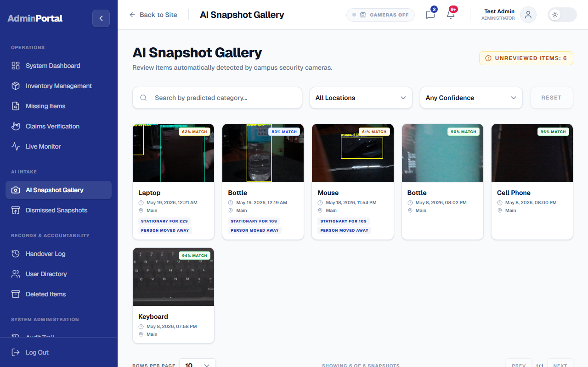
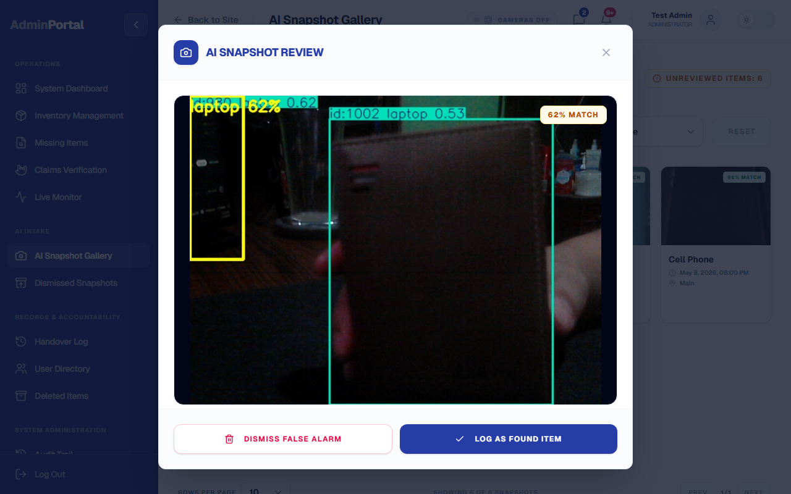
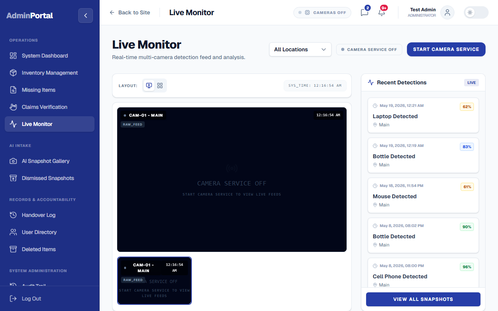
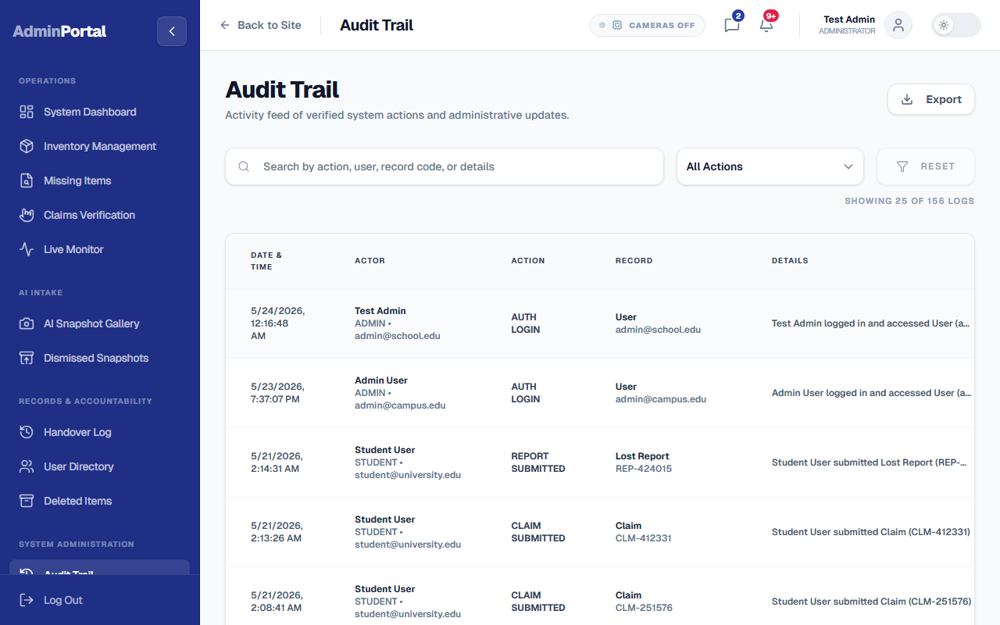

# ReClaim Platform: System Updates & Feature Presentation

## 1. Previous System Updates

### AI Surveillance Daemon Optimization
**Update:** Decoupled the raw video streaming component from the AI inference engine.
**Documentation:** Separated the video stream feed and AI processing thread to resolve performance bottlenecks. The YOLOv8 model was configured with class filtering (backpacks, laptops, bottles, etc.) to target relevant lost item categories and optimize detection latency.

### Reusable UI Components & Admin Handover UI
**Update:** Standardized the confirmation workflow across admin actions and refactored report tracking.
**Documentation:** Extracted duplicate modal implementations into standalone `StatusModal` and `StatusContent` components. Refactored the user-side report tracking (`UserMyReportsPage`) to prioritize active searches and matches over historical closed records, streamlining user navigation.

### Admin Dashboard Analytics Backend
**Update:** Migrated the Admin Dashboard from a static mockup to a live, data-driven interface.
**Documentation:** Added a backend analytics API to aggregate system-wide performance indices (active found inventory, pending claims, camera network health). Integrated these endpoints into the admin front-facing dashboard to provide real-time operational insights.

### Form Sanitization & Header State Resolutions
**Update:** Secured authorization inputs and fixed session persistence bugs on logout.
**Documentation:** Input validation sanitizes all auth forms (stripping trailing whitespace in email and password fields). Resolved navigation state leakage by ensuring strict session token clearance and resetting active React states in the main sidebar and headers on user logout.

---

## 2. Latest System Update

### AI Detection Robustness v1: Stateful Tracking & Multi-Person Conservation
**Update:** Upgraded the computer vision daemon to state-based tracking, implemented proximity-based person attendance logic, and introduced rich reasoning metadata on the frontend review queue.

**Detailed Explanation & Documentation:**

1. **Stateful Tracking & Spatial Matching (`daemon.py`)**:
   Historically, the Python camera service relied strictly on volatile YOLO track IDs, leading to split tracks and duplicate alerts when the detector momentarily lost track. The new architecture implements a persistent spatial state dictionary (`track_history`). Detections are matched across frames using spatial overlap (Intersection-over-Union) and center-distance bounds. An object keeps its history and tracking timer even if the underlying YOLO model fluctuates and assigns a new track ID.
2. **Proximity-Based Human Attendance Checking**:
   To prevent false alarms in crowded scenes, the AI service now verifies if a nearby person is "attending" the object before initiating the abandonment countdown.
   * **Spatial Search Cone**: The daemon uses `is_person_near_item()`, expanding the item bounding box by 75% in all directions and calculating overlap (IoU) with any detected person bounding box.
   * **Distance Threshold**: Matches centers against a camera frame diagonal scale (`PERSON_NEAR_DISTANCE_RATIO = 0.28`). 
   * While a person remains within these bounds, the item is marked as "attended", holding the countdown timer. The timer only starts after all nearby persons exit the boundary.
3. **Stationary & Grace Constraints**:
   An item is only flagged as abandoned if it satisfies three strict criteria:
   * **Stillness**: The item center must not shift by more than `STATIONARY_DIST_THRESHOLD` (50px). If it is moved, the timer resets.
   * **Stationary Duration**: It must remain still for at least `STATIONARY_TIME_THRESHOLD` (10 seconds).
   * **Grace Period**: After a person leaves the item, a grace period of `PERSON_LEFT_GRACE_SECONDS` (3 seconds) is enforced. If the person returns, the timer is aborted.
4. **Spatial Duplicate Suppression**:
   To prevent database spamming of the same abandoned object, the daemon buckets the camera frame into a `10x10` coordinate grid. A unique `duplicateKey` is generated based on camera ID, item class, and grid coordinates. Detections in the same grid bucket are suppressed for `DUPLICATE_SUPPRESSION_SECONDS` (5 minutes) to ensure clean, singular ingestion logs.
5. **Rich Ingestion Metadata & Frontend Reasoning Badges**:
   When an alert is uploaded to the backend, the daemon populates a comprehensive `detectionMeta` JSON payload containing `stationaryDuration`, `personWasNearby`, `personLeftAt`, and a descriptive `reason` text.
   * On the admin UI, `SnapshotDetailsModal.tsx` and `snapshotUtils.ts` have been upgraded to read this metadata and render glowing, glassmorphic **Reasoning Badges** under the header **"Why AI flagged this"**. It displays dynamically computed reasons such as `Stationary for 12s` and `Person moved away` alongside the YOLO model details.

---

## 3. Screen Documentation & Verification Guide

*Use the local development server running at `http://localhost:5173/` to view and capture these screenshots. Save your captured images in the `d:/VSCODE Projects/ReClaim/screenshots/` folder.*

### A. AI Snapshot Gallery with Reasoning Badges

**Documentation & Verification:**
Navigating to the **AI Snapshot Gallery** (`/admin/snapshots`) displays the incoming review queue. Each card contains the image captured by the camera daemon. As verified in this screen, the cards are now equipped with dynamic category labels and confidence ratings parsed directly from the updated `detectionMeta` database records.

### B. AI Snapshot Review Modal

**Documentation & Verification:**
Clicking on a snapshot card opens the **AI Snapshot Review Modal**. Under the **"Why AI flagged this"** panel, you can verify that the system successfully parses the stateful tracking parameters. It displays the active reason tags (e.g. `Stationary for 10s`, `Person moved away`) and provides staff with a clear explanation of the AI's logic, supporting manual approval ("Log as Found") or rejection ("Dismiss False Alarm").

### C. Live Camera Monitor

**Documentation & Verification:**
The **Live AI Monitor** (`/admin/live-monitor`) displays active cameras and overlays bounding boxes around identified objects. On the right-hand panel, the "Recent Detections Feed" dynamically updates. The camera status badge shows the stream's operational state, verifying proper integration with the running computer vision daemon.

### D. Audit Trail Action Logger

**Documentation & Verification:**
The **Audit Trail** (`/admin/audit-logs`) displays chronological logs of all staff actions. Any time an administrator dismisses a stateful AI alert or logs it as a found item, a corresponding audit record is committed. This guarantees high reliability, operational compliance, and strict administrative accountability.
